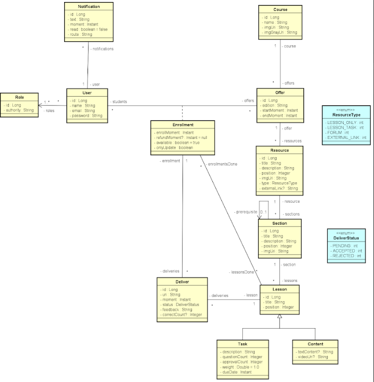

# DSLearn

DSLearn é uma plataforma de ensino que gerencia cursos, suas turmas, alunos, e um fórum para perguntas e respostas sobre os conteúdos dos cursos. O sistema possui diferentes papéis, como alunos, professores e administradores, cada um com permissões específicas.

## Visão Geral

O sistema consiste em uma plataforma que mantém informações de cursos, suas turmas, alunos e um fórum de discussão. Os usuários são divididos em alunos, professores e administradores, sendo que apenas administradores podem cadastrar cursos e turmas.

## Funcionalidades

### Cursos

Um curso é composto por vários recursos. Estes recursos podem ser:
- Trilhas de aprendizado
- Bônus
- Links externos
- Fórum de perguntas e respostas

Cada recurso pode conter seções, e estas seções contêm aulas, que podem ser em formato de vídeo, texto ou tarefas.

### Recursos

Os recursos são agrupamentos de conteúdo dentro de um curso. Cada recurso pode ter uma ou mais seções, que contêm as aulas.

### Aulas

As aulas podem ser:
- Conteúdos em vídeo
- Conteúdos em texto
- Tarefas para serem entregues pelos alunos

### Tarefas

As tarefas possuem:
- Peso
- Data de entrega
- Número de questões
- Quantidade mínima de acertos para aceitação

Quando um aluno entrega uma tarefa, ela aguarda o feedback do professor, podendo ser aceita ou rejeitada.

### Ofertas

Cada nova turma de um curso é uma oferta ou edição desse curso, com datas de início e fim. As diferentes ofertas de um mesmo curso podem ter variações no conteúdo para customização conforme a necessidade de cada turma.

### Notificações

Os usuários (alunos e professores) recebem notificações sobre diversas atividades e atualizações no sistema.

## Estrutura do Banco de Dados

O diagrama de classes a seguir representa a estrutura do banco de dados do sistema:

### Principais Entidades

- **User**: Representa os usuários do sistema, que podem ter diferentes papéis (aluno, professor, administrador).
- **Role**: Define as permissões dos usuários.
- **Notification**: Notificações enviadas aos usuários.
- **Course**: Cursos oferecidos pela plataforma.
- **Offer**: Edições ou turmas de um curso.
- **Enrollment**: Matrículas dos alunos nas ofertas de cursos.
- **Resource**: Recursos dentro de um curso.
- **Section**: Seções dentro de um recurso.
- **Lesson**: Aulas dentro de uma seção.
- **Task**: Tarefas para serem realizadas pelos alunos.
- **Deliver**: Entregas de tarefas pelos alunos, aguardando avaliação.

### Enums

- **ResourceType**: Tipos de recursos (LESSON_ONLY, LESSON_TASK, FORUM, EXTERNAL_LINK)
- **DeliverStatus**: Status da entrega das tarefas (PENDING, ACCEPTED, REJECTED)

## Requisitos do Sistema

- Java 11 ou superior
- Spring Boot
